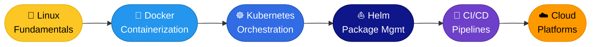
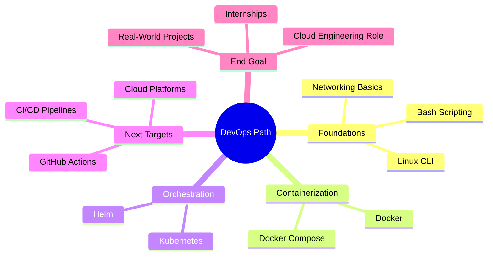

<div align="center">


<br/>

[](/)
[](/)
[](/)
[](/)

<br/>


<br/>

> *"Learning in public. Building in real. One day at a time."*

</div>

---

## 👨‍💻 About This Repository

I'm a **1st-year Software Engineering undergraduate** on a focused path toward Cloud & DevOps engineering. This repo is my structured learning journal — every folder, note, and exercise represents real hands-on work, not just theory.

The goal isn't just to learn tools. It's to build the **engineering mindset** required for real-world production environments.

---

## 🗺️ Learning Roadmap



---

## 📂 Repository Structure

```
📦 linux-devops-notes/
├── 🐧 linux/
│   ├── day-01-filesystem/
│   ├── day-02-permissions/
│   ├── day-03-package-management/
│   ├── day-04-processes/
│   ├── day-05-bash-scripting/
│   └── ...
├── 🐳 docker/
│   ├── day-20-images-containers/
│   ├── day-25-dockerfiles/
│   ├── day-28-volumes/
│   ├── day-32-networking/
│   └── day-35-compose/
├── ☸️ kubernetes/
│   ├── day-40-fundamentals/
│   ├── day-45-services/
│   ├── day-50-storage/
│   ├── day-55-autoscaling/
│   ├── day-58-ingress/
│   └── day-60-helm-advanced/
└── README.md
```

---

## 📘 Curriculum Coverage

### 🐧 Linux Fundamentals

| Topic | Status |
|---|---|
| File system navigation & management | ✅ Complete |
| Permissions, users & groups | ✅ Complete |
| Package management (apt / yum) | ✅ Complete |
| Process & service monitoring | ✅ Complete |
| Environment variables | ✅ Complete |
| Bash scripting basics | ✅ Complete |

---

### 🐳 Docker

| Topic | Status |
|---|---|
| Images & containers | ✅ Complete |
| Writing Dockerfiles | ✅ Complete |
| Volumes & data persistence | ✅ Complete |
| Networking & port mapping | ✅ Complete |
| Docker Compose (multi-container apps) | ✅ Complete |

---

### ☸️ Kubernetes

| Topic | Status |
|---|---|
| Pods, Deployments & ReplicaSets | ✅ Complete |
| Services — ClusterIP, NodePort, LoadBalancer | ✅ Complete |
| ConfigMaps & Secrets | ✅ Complete |
| PersistentVolumes & PersistentVolumeClaims | ✅ Complete |
| Namespaces & Resource Limits | ✅ Complete |
| Liveness & Readiness Probes | ✅ Complete |
| Horizontal Pod Autoscaling (HPA) | ✅ Complete |
| Monitoring — Logs & Metrics | ✅ Complete |
| Ingress & External Access | ✅ Complete |
| Helm — Charts, Upgrade & Rollback | ✅ Complete |

---

## 📈 Progress Snapshot

```
Linux Fundamentals   ████████████████████  100%
Docker               ████████████████████  100%
Kubernetes           ████████████████████  100%
Helm                 ████████████████████  100%
CI/CD Pipelines      ░░░░░░░░░░░░░░░░░░░░    0%   ← Next
Cloud Platforms      ░░░░░░░░░░░░░░░░░░░░    0%   ← Upcoming
```

---

## 🎯 Goals



---

## 🧠 Learning Philosophy

| Principle | What It Means in Practice |
|---|---|
| 🔁 **Daily habit** | Consistent small steps over random bursts |
| 🛠 **Hands-on first** | Every concept gets deployed, not just read |
| 📢 **Learn in public** | Progress documented openly on GitHub |
| 📓 **Notes as artifacts** | Notes are portfolio pieces, not just scratch pads |
| 📐 **Systems thinking** | Understanding *why*, not just *how* |

---

## 🔥 Current Status

```
✅  60+ Days of structured learning completed
📝  Daily notes documented on GitHub
🛠  Hands-on mini-projects shipped
☸️  Comfortable deploying real apps on Kubernetes
⛵  Advanced Helm workflows mastered
🎯  Moving toward CI/CD and cloud platforms next
```

---

## 🤝 Connect

I share my learning journey, notes, and progress on **LinkedIn** — where I post consistently about what I'm building and discovering.

If you're on a similar path, let's connect.

[](https://linkedin.com)
[](https://github.com)

---

<div align="center">

*Built with consistency. Documented with intention.*


</div>
