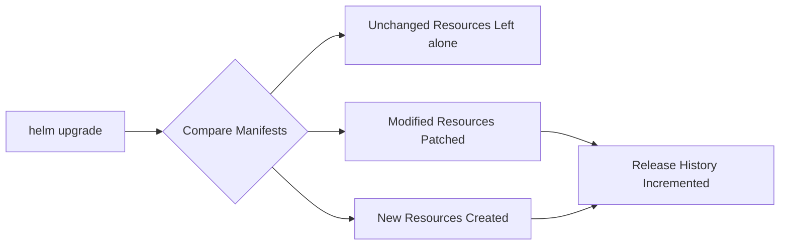
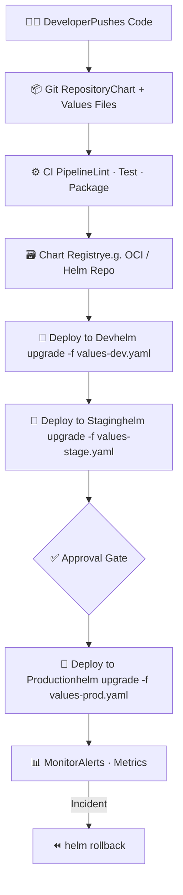

# 🚢 Day 60 — Helm Advanced


> **Goal:** Master advanced Helm patterns used in real-world, production-grade Kubernetes deployments — including multi-environment config management, safe upgrades, and rollback strategies.

---

## 📚 Table of Contents

- [values.yaml Deep Dive](#-valuesyaml-deep-dive)
- [Multi-Environment Strategy](#-multi-environment-strategy)
- [Helm Upgrade](#-helm-upgrade)
- [Helm Rollback](#-helm-rollback)
- [Team Workflow](#-team-workflow)
- [Key Takeaways](#-key-takeaways)

---

## 🔧 `values.yaml` Deep Dive

`values.yaml` is the **single source of truth** for a Helm chart's configuration. Rather than modifying Kubernetes manifests directly, you declare values here and Helm injects them at render time.

```yaml
# values.yaml
replicaCount: 2

image:
  repository: nginx
  tag: "1.21"

service:
  type: NodePort
  port: 80
```

> 💡 **Why it matters:** Separating config from templates means your chart logic stays clean and reusable, while environment-specific values live in their own files.

---

## 🌍 Multi-Environment Strategy

Instead of one monolithic config, teams maintain **per-environment values files** that override the base `values.yaml`.

```
charts/
└── myapp/
    ├── Chart.yaml
    ├── values.yaml          ← base defaults
    └── templates/

values/
├── values-dev.yaml          ← dev overrides
├── values-stage.yaml        ← staging overrides
└── values-prod.yaml         ← production overrides
```

### Environment Comparison

| Setting | Dev | Staging | Production |
|---|---|---|---|
| `replicaCount` | 1 | 2 | 5 |
| `resources.requests.cpu` | 100m | 250m | 500m |
| `resources.requests.memory` | 128Mi | 256Mi | 512Mi |
| `image.tag` | `latest` | `rc-1.2` | `1.2.0` |

### Deploying to a Specific Environment

```bash
# Deploy to dev
helm install myapp ./chart -f values/values-dev.yaml

# Deploy to production
helm install myapp ./chart -f values/values-prod.yaml
```

---

## ⬆️ Helm Upgrade

`helm upgrade` is the mechanism for safely rolling out new versions or config changes to a live release.

```bash
# Basic upgrade
helm upgrade myapp ./mychart

# Upgrade with environment-specific values
helm upgrade myapp ./mychart -f values/values-prod.yaml

# Upgrade and install if not already deployed
helm upgrade --install myapp ./mychart -f values/values-prod.yaml
```

### What Helm Does Under the Hood



---

## ⏪ Helm Rollback

One of Helm's most powerful production safety features is **built-in release history and rollback**.

```bash
# View full release history
helm history myapp
```

```
REVISION  STATUS      CHART         APP VERSION  DESCRIPTION
1         superseded  myapp-0.1.0   1.0.0        Install complete
2         superseded  myapp-0.1.0   1.1.0        Upgrade complete
3         deployed    myapp-0.1.0   1.2.0        Upgrade complete
```

```bash
# Roll back to a specific revision
helm rollback myapp 2

# Roll back to the immediately previous release
helm rollback myapp
```

> ⚠️ **Production note:** Always check `helm history` before rolling back. Rollbacks are instantaneous but irreversible without another upgrade.

---

## 👥 Team Workflow

A mature team Helm workflow typically looks like this:



### Best Practices Observed in Real Teams

- **One chart per application** — keeps scope clear and versioning simple
- **Charts stored in Git** — enables code review, audit trails, and reproducibility
- **CI/CD runs `helm lint` and `helm template`** before any deploy
- **Separate values files per environment** — never hardcode environment config in templates

---

## 🏁 Key Takeaways

| Concept | What It Does | Why It Matters |
|---|---|---|
| `values.yaml` | Centralises configuration | Keeps templates clean and reusable |
| Multi-env values files | Per-environment overrides | Safe, isolated deployments |
| `helm upgrade` | Applies changes to live releases | Minimal disruption, diff-aware |
| `helm history` | Tracks all release revisions | Full audit trail |
| `helm rollback` | Reverts to a previous revision | Fast incident recovery |

---

<div align="center">

**[← Day 59](../day-59/)** &nbsp;|&nbsp; **[100 Days of DevOps](../../README.md)** &nbsp;|&nbsp; **[Day 61 →](../day-61/)**

*Part of my #100DaysOfDevOps journey*

</div>
